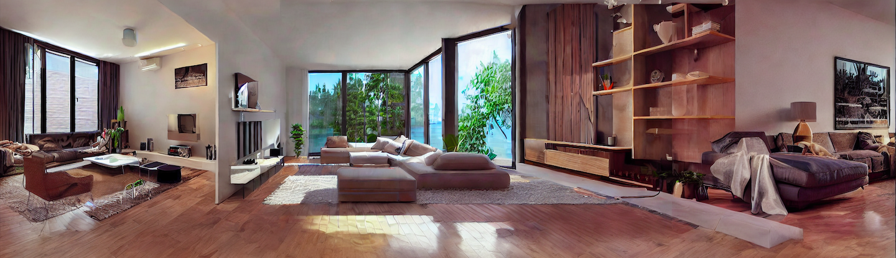
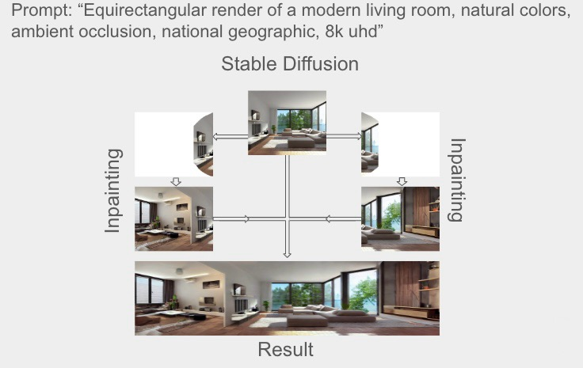

# This is a [Stable Diffusion](https://huggingface.co/docs/diffusers/v0.13.0/en/stable_diffusion) and  [A-frame](https://aframe.io) project.




## Getting Started

First, clone this repository:

```bash
https://github.com/felipealbuq/GAVIA.git
```

Open the file index.html and you need some live preview server, then open the browser and see the result.

## Generation Flow
Below, you can see the generation flow of images that forms the final image seen previously using Stable Diffusion and Inpaiting.



## Learn More

To learn more about Stable Diffusion and A-frame, take a look at the following resources:

- [Stable Diffusion Documentation](https://huggingface.co/docs/diffusers/en/using-diffusers/conditional_image_generation) - learn about Diffusers and Stable Diffusion.

- [Inpainting Documentation](https://huggingface.co/docs/diffusers/en/using-diffusers/inpaint) - learn about Diffusers and Inpaiting.

- [A-Frame Documentation](https://aframe.io/docs/1.5.0/introduction/) - learn about A-Frame features and API.

- [Learn A-frame](https://aframe.io/examples/showcase/helloworld/) - an interactive A-frame tutorial.


## Deploy on GitHub Pages

Check out my [GAVIA](https://felipealbuq.github.io/GAVIA/)
